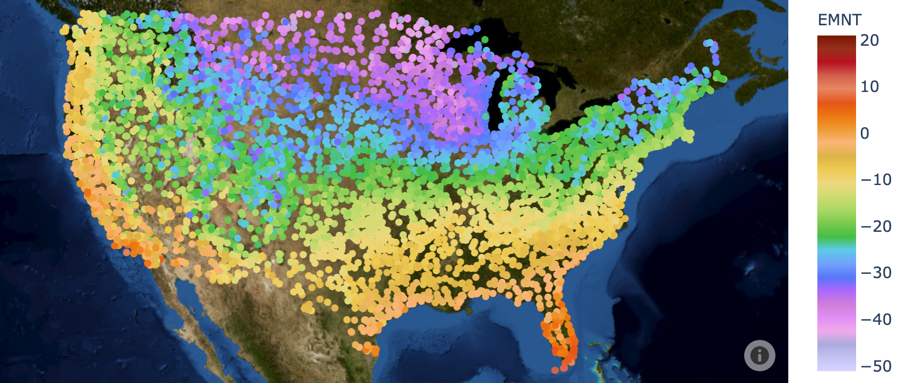

# Creating an Updated Plant Hardiness Map

[@FoodForestNetwk](https://twitter.com/FoodForestNetwk) recently [tweeted](https://twitter.com/FoodForestNetwk/status/1321995133584318464?s=20) that the [USDA Plant Hardiness Zone Map](https://planthardiness.ars.usda.gov/PHZMWeb/) is woefully out of date. So I started throwing together some jupyter notebooks for playing with the latest data and seeing if I could craft an updated hardiness map.

## Notebooks

- [Experiments with Basemap](hardiness_basemap.ipynb)
- [Experiments with Plotly Contour](hardiness_plotly_contour.ipynb)
- [Experiments with Mapbox](hardiness_mapbox_scatter.ipynb)
- [Getting the data](grab_data.ipynb)

