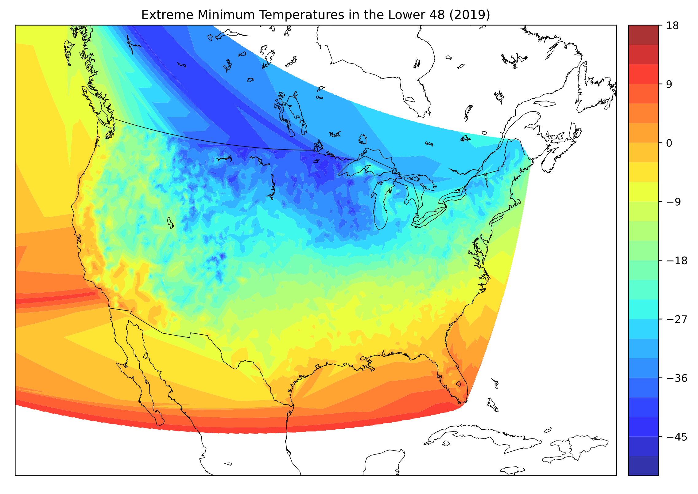

# Creating an Updated Plant Hardiness Map

[@FoodForestNetwk](https://twitter.com/FoodForestNetwk) recently [tweeted](https://twitter.com/FoodForestNetwk/status/1321995133584318464?s=20) that the [USDA Plant Hardiness Zone Map](https://planthardiness.ars.usda.gov/PHZMWeb/) is woefully out of date. This repo contains an initial exploration of the problem.

### [See the latest interactive map](https://fletchgraham.github.io/hardiness/)

or see the [notebook used to generate the interactive map](hardiness_mapbox_scatter.ipynb)

## D3 on Observable

There is also an in-progress observable notebook for this map: https://observablehq.com/@fletchgraham/us-plant-hardiness-zones

---

## Goals

- Create a map of plant hardiness zones in the US
- The map should reflect the latest available data
- The map should be interactive
- *add more constraints here*

### What is a Hardiness Zone?

To figure out what kind of data to look for, a hardiness zone needs to be defined. From looking at the USDA hardiness map I gleaned that the zones are simply defined by the average extreme minimum temperature for the year.

### Finding the Data

On the NOAA NCEI site I found that I could download a "Global Summary of the Year" for the entire world which seemed to have the minimum temperature data I was after.

The dataset is quite large with a lot of extra info so I spent some time in a notebook filtering it down. Also to save my poor laptop I got rid of any years before 2019 though in some spots it goes back to the seventies.

See [the jupyter notebook](grab_data.ipynb) which contains python code for fetching the data, filtering it, and saving out a winnowed CSV.

### Initial Visualization

After filtering, I was left with ~5000 rows. Just to see what I was working with I scattered the filtered data onto a map using a deprecated python library called Basemap.

Encouraging! looks about as one would expect. see [the notebook that generated this plot](hardiness_basemap.ipynb)

### Interactivity and USGS

The [interactive map](https://fletchgraham.github.io/hardiness/) was created using Plotly which provides a high level way to scatter data onto a Mapbox map. The map fetches USGS tiles from ArcGIS.

[see the notebook](hardiness_mapbox_scatter.ipynb)

### But How Do We Draw Zones?

What we're after is a "filled contour plot" which plotly can make, but I haven't figured out how to draw those polygons onto the Plotly mapbox map. 

[*see the notebook*](hardiness_plotly_contour.ipynb)

I managed to make such a contour plot on an actual map, but it was using the deprecated Basemap library:

[*see the notebook*](hardiness_basemap.ipynb)

### Helpful Links

- Interpolation: http://www.bisolutions.us/A-Brief-Introduction-to-Spatial-Interpolation.php
- I'm also looking at [Holoviz Datashader](https://datashader.org/) to potentially solve this problem
- just found this about drawing polygons on a plotly map: https://community.plotly.com/t/draw-polygon-in-mapbox-with-dash-python/34917/5
- and if we want to use D3 there is this https://observablehq.com/@d3/geotiff-contours?collection=@d3/d3-contour

